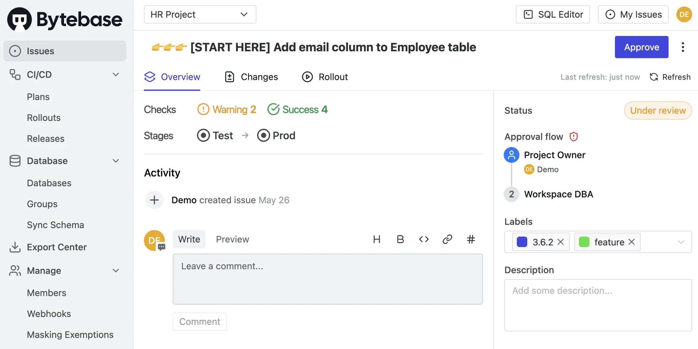
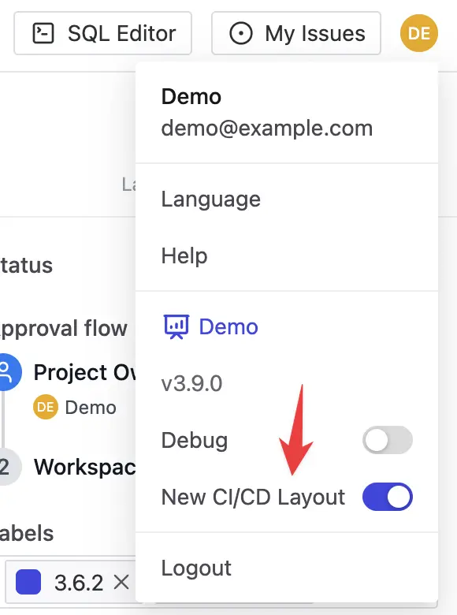

import InstallUpgrade from '/snippets/install/install-upgrade.mdx';

## 🌟 New Database CI/CD Experience

New database CI/CD experience is now enabled by default. The new layout splits a monolithic page into dedicated tabs for clearer information display and efficient batch change management:

- **Overview** tab displays general change details and approval status
- **Changes** tab lists database changes and their targets
- **Rollout** tab manages the deployment process
- In addition to the layout update, the new design also introduces the following new features:
  - Multi-task rollback.
  - Plan draft to stage changes.

Users can still switch back to the old layout via the profile dropdown in the top-right corner.

## 🔔 Other Notable Changes

- Changelist is no longer available in the new CI/CD layout. Switch to the old layout to access it. You can draft a plan in the new CI/CD layout to stage multiple changes.
- Remove `--rollout-title` flag from the `bytebase-action rollout` command (titles now inherit from associated plans and cannot be set separately).
- Deprecate per-database secret variable.

## 🎄 Enhancements

- Add transaction mode directives `--txn-mode=on/off` to toggle transaction wrapping, supporting MySQL/PostgreSQL/Oracle/SQL Server/TiDB/Redshift.
- Add Terraform plugin support for Project webhook settings and Instance external_secret.

## 🐞 Bug Fix

- Fix inconsistent user group display on page refresh.

<InstallUpgrade />
